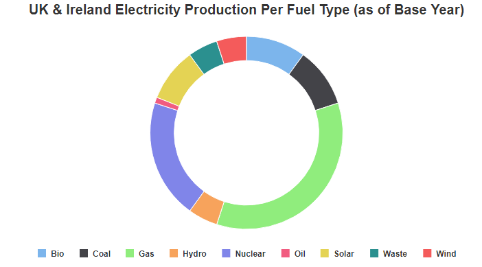
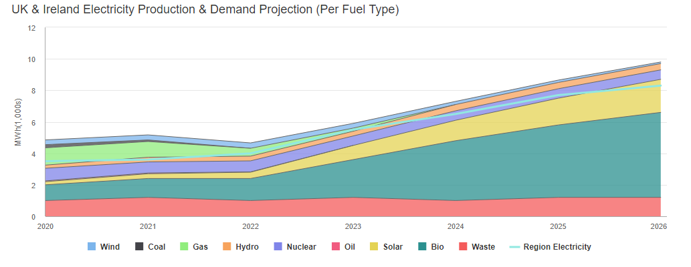
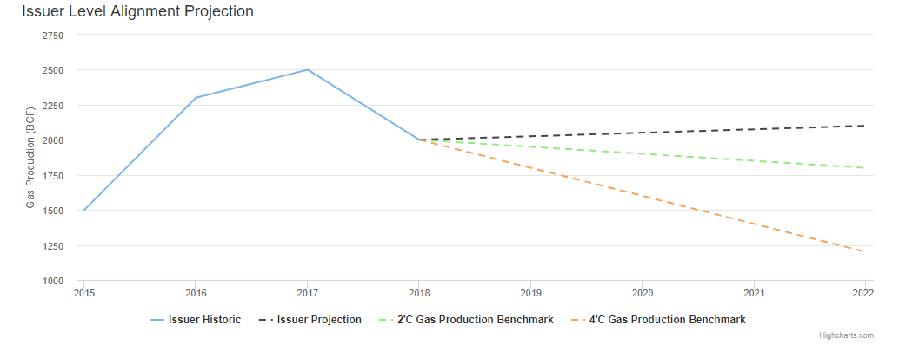
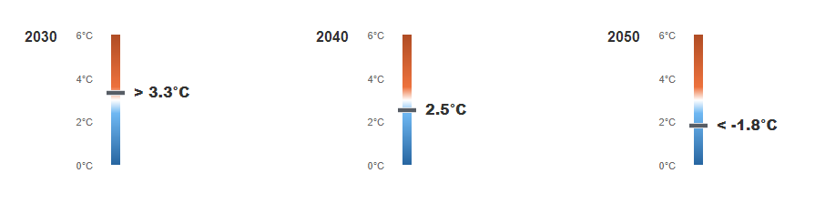
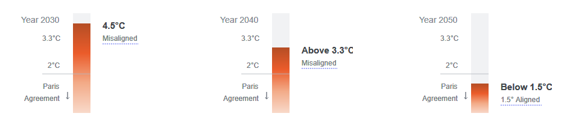

# Getting Started with Angular Highchart Example
Using Customized Highchart in Angular. Area, line, pie, bullet, column chart.

### Pie Chart

### Area Chart

### Line Chart

### Bullet Chart

### Column Chart

